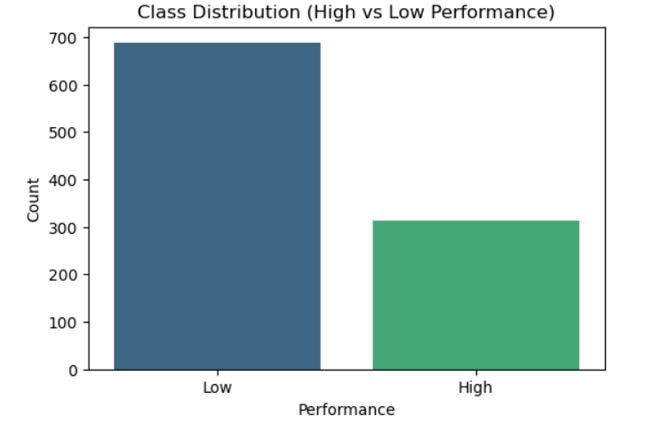
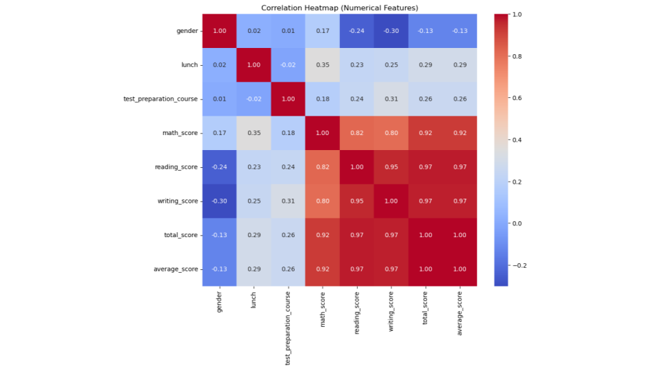
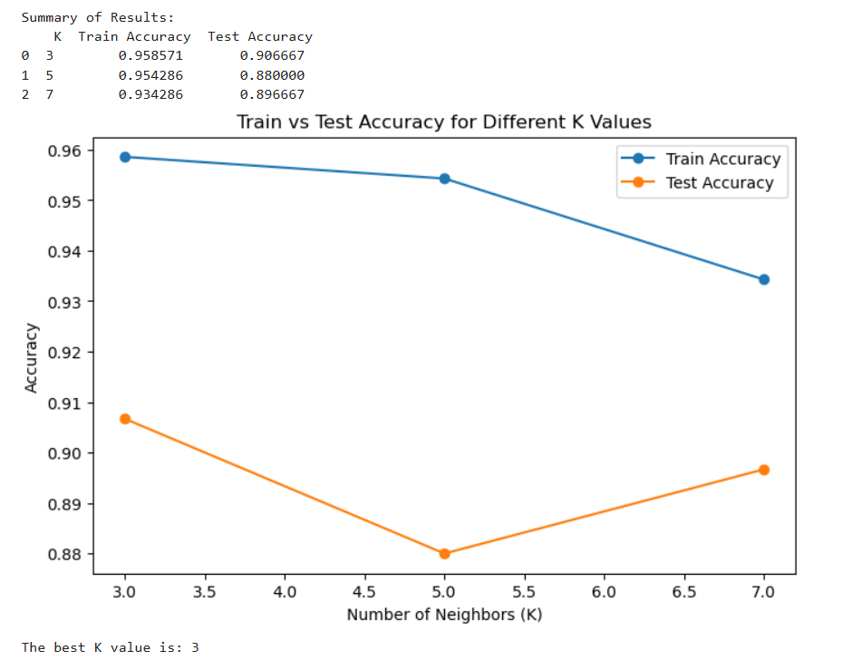
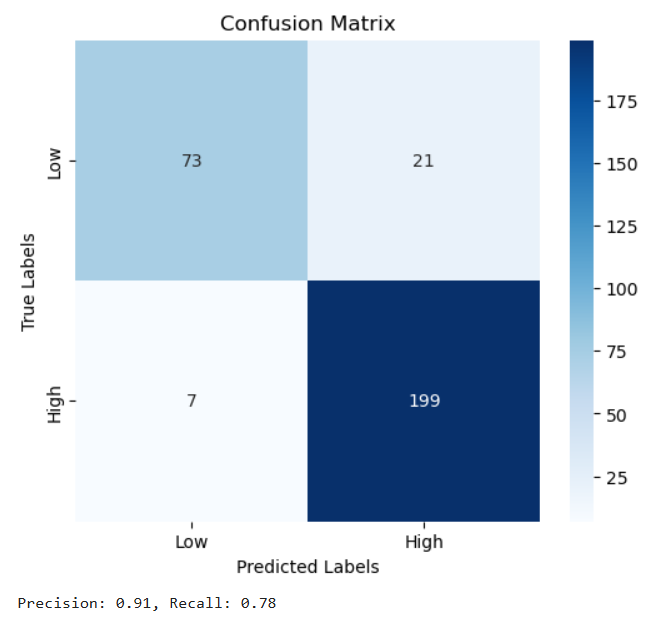

## Student Performance Classification using KNN

### About this project
This project focuses on predicting student performance (High vs Low) using a binary classification approach. The dataset was preprocessed and analyzed to understand patterns influencing academic performance, followed by building a K-Nearest Neighbors (KNN) model to classify students based on their scores and demographic attributes.

This was an individual project completed as part of the *Data Science for Business* coursework.

---

### Tools & Libraries
- Python  
- Pandas  
- Scikit-learn  
- Matplotlib / Seaborn  
- Jupyter Notebook  

---

### Dataset
The dataset contains 1000 student records with 10 features, including demographic information and subject scores. A binary target variable was created to classify students as:

- **High Performance:** Average score ≥ 75  
- **Low Performance:** Average score < 75  

---

### What I worked on
- Explored dataset distributions and feature relationships using visualizations  
- Created a binary target variable for classification  
- Encoded categorical variables using OneHotEncoder  
- Standardized numerical features using StandardScaler  
- Built and evaluated KNN models with different K values (3, 5, 7)  
- Compared model performance using accuracy, precision, recall, and confusion matrix  

---

### Key insights
- Subject scores (math, reading, writing) were highly correlated with overall performance  
- Class imbalance existed with more Low Performance students  
- Increasing K improved generalization but slightly reduced training accuracy  
- K=3 provided the best balance between accuracy and model simplicity  

---

### How to run this project
1. Open `student_performance_knn.ipynb`  
2. Install required libraries  
3. Run all cells to reproduce analysis and results  

---

### Timeline
Completed in 2024 as part of Data Science for Business coursework.

## Visual Insights

### Class Distribution

### Correlation Heatmap

### Accuracy vs K Value

### Confusion Matrix

